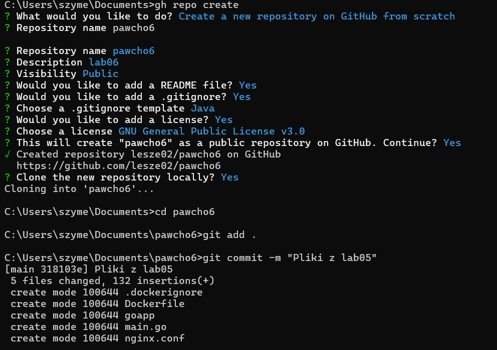

# Tworzenie repozytorium

# Użyte komendy

## Budowanie obrazu
PS C:\Users\szyme\documents\pawcho6> $env:DOCKER_BUILDKIT = "1"

docker build --ssh default -t lab6 .

## Logowanie do ghcr.io oraz przesłanie obrazu
PS C:\Users\szyme\documents\pawcho6> echo $env:CR_LAB | docker login ghcr.io -u Lesze02 --password-stdin

PS C:\Users\szyme\documents\pawcho6> docker tag lab6 ghcr.io/lesze02/pawcho6:lab6

PS C:\Users\szyme\documents\pawcho6> docker push ghcr.io/lesze02/pawcho6:lab6

# Zawartość pliku Dockerfile
  #syntax=docker/dockerfile:1.4

  FROM alpine AS builder

  RUN apk add --no-cache openssh-client git

  ARG VERSION=1.0
  ENV VERSION=$VERSION

  RUN mkdir -p /root/.ssh && \
    ssh-keyscan github.com >> /root/.ssh/known_hosts

  RUN --mount=type=ssh git clone git@github.com:Lesze02/pawcho6.git /lab06

  FROM nginx:alpine

  COPY --from=builder /lab06/goapp /usr/local/bin/goapp

  COPY --from=builder /lab06/nginx.conf /etc/nginx/nginx.conf

  CMD /usr/local/bin/goapp & nginx -g 'daemon off;'

  HEALTHCHECK --interval=10s --timeout=5s \
    CMD curl -f http://localhost || exit 1

# Link do obrazu

https://github.com/users/lesze02/packages/container/package/pawcho6